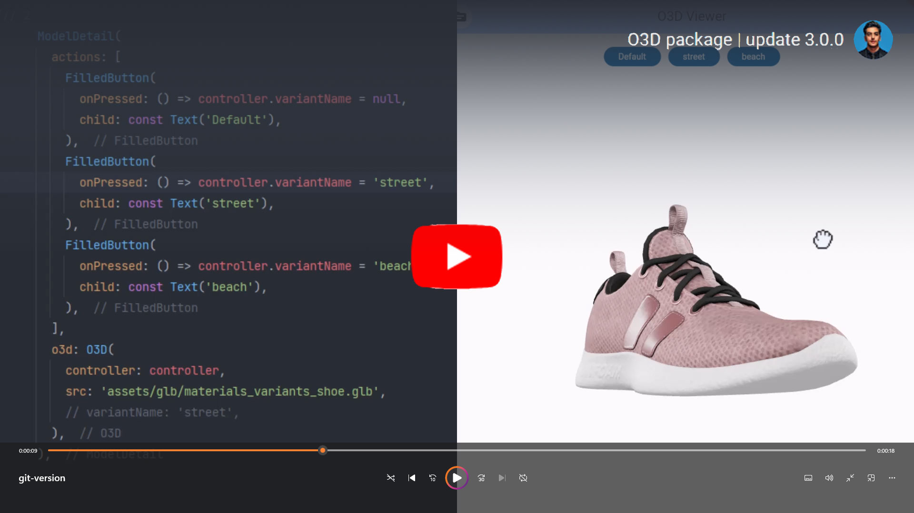

# O3D - Model Viewer for Flutter

This is a [Flutter](https://flutter.dev) widget for rendering interactive
3D models in the [glTF](https://www.khronos.org/gltf/) and
[GLB](https://wiki.fileformat.com/3d/glb/) formats.

The widget embeds Google's [`<model-viewer>`](https://modelviewer.dev)
web component in a [WebView](https://pub.dev/packages/webview_flutter).


https://github.com/babakcode/o3d/assets/31356659/5c9faddf-f0b7-41b5-a703-0035718ecf57


## Screenshot

online demo 1: [https://babakcode.github.io/ui_3d_test/](https://babakcode.github.io/ui_3d_test/)

online demo 2: [https://babakcode.github.io/ui_3d_flutter/](https://babakcode.github.io/ui_3d_flutter/)

<a href="https://www.youtube.com/watch?v=YAOYXTLlXdw"></a>

https://github.com/babakcode/o3d/assets/31356659/5c9faddf-f0b7-41b5-a703-0035718ecf57

|                                                  old man                                                  |                                                                   Astronaut                                                                    |  
|:---------------------------------------------------------------------------------------------------------:|:----------------------------------------------------------------------------------------------------------------------------------------------:|  
|  |  |  


## Compatibility

- Android
- iOS (AR View may not available on iOS 16+)
- Web, with [a recent system browser version](https://modelviewer.dev/#section-browser-support).

## Installation

### `pubspec.yaml`

```yaml
dependencies:
  o3d: 3.0.0
```

### `AndroidManifest.xml` (Android 9+ only)

**Test on `real device`** and to use this widget on Android 9+ devices, your app must be permitted to make an HTTP connection
to `http://localhost:XXXXX`.
Android 9 (API level 28) changed the default for [`android:usesCleartextTraffic`] from `true`
to `false`,
so you will need to configure your app's `android/app/src/main/AndroidManifest.xml` as follows:

```diff

+    <uses-permission android:name="android.permission.INTERNET"/>

     <application
        android:name="${applicationName}"
        android:icon="@mipmap/ic_launcher"
        android:label="example"
+       android:usesCleartextTraffic="true">
        <activity
            android:name=".MainActivity"
```

This does not affect Android 8 and earlier. See [#7] for more information.

### `app/build.gradle` (Android only)

Change minSdkVersion to 21.

    defaultConfig {
        ...
        minSdkVersion 21
        ...
    }

### `Info.plist` (iOS only)

To use this widget on iOS, you need to opt-in to the embedded views preview
by adding a boolean property to your app's `ios/Runner/Info.plist` file, with
the key `io.flutter.embedded_views_preview` and the value `YES`:

```xml

<key>io.flutter.embedded_views_preview</key><true />
```

### `web/index.html` (Web only)

Modify the `<head>` tag of your `web/index.html` to load the JavaScript, like so:

```html

<head>

    <!-- Other stuff -->

    <script type="module"
            src="https://ajax.googleapis.com/ajax/libs/model-viewer/3.1.1/model-viewer.min.js"
            defer></script>
</head>
```

`./assets/packages/model_viewer_plus/assets/model-viewer.min.js` will use the default js file which
is included in this package's asset. The [official site](https://modelviewer.dev) uses unpkg, by
using `https://unpkg.com/@google/model-viewer/dist/model-viewer.min.js`, you are using the latest
version of `<model-viewier>`. You may replace the
value of `src` attribute with another CDN mirror's URL. But please notice that our model-viewer-plus
maybe not able to keep up with the `<model-viewier>`'s latest version.


## Notes

We use
the [Google APP](https://play.google.com/store/apps/details?id=com.google.android.googlequicksearchbox)
, `com.google.android.googlequicksearchbox` to display interactive 3D models on Android.
The model displays in 'ar_preferred' mode by default, Scene Viewer launches in AR native mode as the
entry mode.
If [Google Play Services for AR (ARCore, `com.google.ar.core`)](https://play.google.com/store/apps/details?id=com.google.ar.core)
isn't present, Scene Viewer gracefully falls back to 3D mode as the entry mode.


## Features

- Renders glTF and GLB models. (Also, [USDZ] models on iOS 12+.)

- Supports animated models, with a configurable auto-play setting.

- Optionally supports launching the model into an [AR] viewer.

- Optionally auto-rotates the model, with a configurable delay.

- Supports a configurable background color for the widget.

[USDZ]: https://graphics.pixar.com/usd/docs/Usdz-File-Format-Specification.html

[AR]:   https://en.wikipedia.org/wiki/Augmented_reality

## Examples

### Importing the library

```dart
import 'package:o3d/o3d.dart';
```

### Creating a `O3D` widget

```diff
class _MyHomePageState extends State<MyHomePage> {
  
  // to control the animation
+ O3DController controller = O3DController();

  @override
  Widget build(BuildContext context) {
    return Scaffold(
      appBar: AppBar(
        backgroundColor: Theme.of(context).colorScheme.inversePrimary,
        title: Text(widget.title),
        actions: [
          IconButton(
              onPressed: () => 
+                 controller.cameraOrbit(20, 20, 5),
              icon: const Icon(Icons.change_circle)),
          IconButton(
              onPressed: () =>
+                 controller.cameraTarget(1.2, 1, 4), 
              icon: const Icon(Icons.change_circle_outlined)),
        ],
      ),
+     body: O3D(
+       controller: controller,
+       src: 'assets/glb/jeff_johansen_idle.glb',
+     ),
    );
  }
}
```

### New feature is **controller**

methods:

1. cameraTarget:

use **controller.cameraTarget(20, 20, 5)**

> According to web-based features https://modelviewer.dev/examples: Set the starting and/or
> subsequent point the camera orbits around.  
> Accepts values of the form "$X $Y $Z", like "0m 1.5m -0.5m".  
> Also supports units in centimeters ("cm") or millimeters ("mm").  
> A special value "auto" can be used, which sets the target to  
> the center of the model's bounding box in that dimension.  
> Any time this value changes from its initially configured value,  
> the camera will interpolate from its current position to the new value.

2. cameraOrbit:

use **controller.cameraOrbit(1.2, 1, 4)**

> According to web-based features https://modelviewer.dev/examples:
> Set the starting and/or subsequent orbital position of the camera.  
> You can control the azimuthal, theta, and polar, phi, angles (phi is measured down from the top),  
> and the radius from the center of the model. Accepts values of the form "$theta $phi $radius",  
> like "10deg 75deg 1.5m". Also supports units in radians ("rad") for angles and centimeters ("cm")
> or  
> millimeters ("mm") for camera distance. Camera distance can also be set as a percentage ('%'),  
> where 100% gives the model tight framing within any window based on all possible theta and phi
> values.  
> Any time this value changes from its initially configured value, the camera will interpolate from
> its current  
> position to the new value. Any value set to 'auto' will revert to the default. For camera-orbit,
> camera-target  
> and field-of-view, parts of the property value can be configured with CSS-like functions. The CSS
> calc() function  
> is supported for these values, as well as a specialized form of the env() function. You can use env(
> window-scroll-y)  
> anywhere in the expression to get a number from 0-1 that corresponds to the current top-level scroll
> position of the  
> current frame. For example, a value like "calc(30deg - env(window-scroll-y) * 60deg) 75deg 1.5m"
> cause the camera to  
> orbit horizontally around the model as the user scrolls down the page.

***other methods will be added as soon as possible.***

### Loading a bundled Flutter asset

```dart
body: O3D
(
// ...
src
:
'
assets/MyModel.glb
'
,
// ...
)
,
```

### Loading a model from the file system

This is not avaliable on Web.

```dart
body: O3D
(
// ...
src
:
'
file:///path/to/MyModel.glb
'
,
// ...
)
,
```

### Loading a model from the web

```dart
body: O3D
(
// ...
src
:
'
https://modelviewer.dev/shared-assets/models/Astronaut.glb
'
,
// ...
)
,
```

Note that due to browsers' [CORS] security restrictions, the model file
*must* be served with a `Access-Control-Allow-Origin: *` HTTP header.

## Frequently Asked Questions

### Q: Why doesn't my 3D model load and/or render?

**A:** There are several reasons why your model URL could fail to load and
render:

1. It might not be possible to parse the provided glTF or GLB file.
   Some tools can produce invalid files when exporting glTF. Always
   run your model files through the [glTF Validator] to check for this.

[CORS]:                     https://developer.mozilla.org/en-US/docs/Web/HTTP/CORS

[glTF Validator]:           https://github.khronos.org/glTF-Validator/

[`android:usesCleartextTraffic`]: https://developer.android.com/guide/topics/manifest/application-element#usesCleartextTraffic
